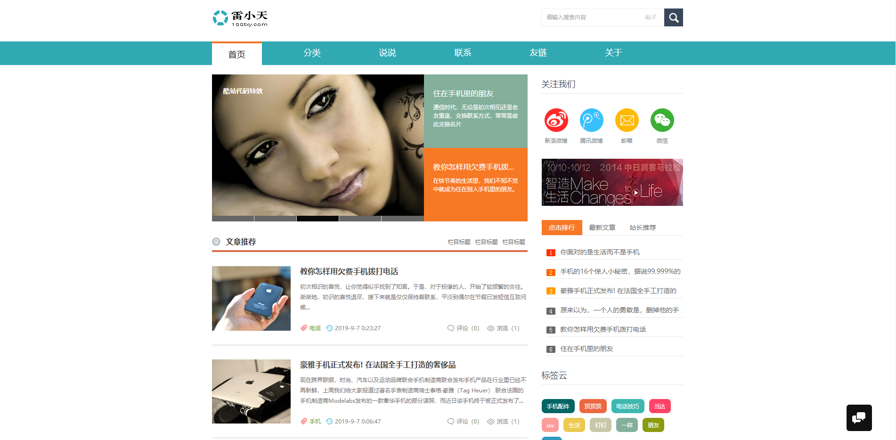
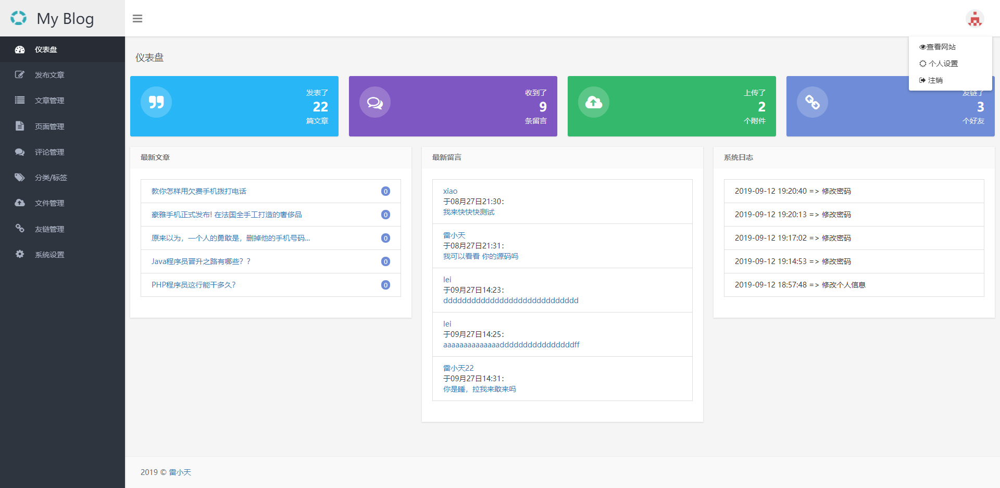

# SpringBoot
SpringBoot学习项目

### 开发文档  
* 注意事项
 1. 运行项目前请确认安装好了mysql和redis 
 2. 暂时没有想到
 3. 这个也没有想到
 
### 学习笔记  
* springboot启动方式
 1. @EnableAutoConfiguration 注解作用：扫包范围 默认在当前类里面（注解在类上面） 
 2. 启动 加上扫包范围注解@ComponentScan(cn.lxtkj.springboot.controller),如果是多个时@ComponentScan(basePackages = {"cn.lxtkj.springboot.controller","cn.lxtkj.springboot.dao"})不建议这种方式，建议使用@SpringBootApplication
 3. @SpringBootApplication等同@EnableAutoConfiguration + @ComponentScan同级包（SpringBootApplication同级包为：cn.lxtkj.springboot）和当前包，所以启动类一般放最外面
 
 ### 开发记录
 * ##### 整合freemarker
 * ##### 整合全局捕获异常
    ###### 全局捕获异常，使用AOP技术，采用异常通知
 * ##### 整合mybatis
 * ##### @Transactional事务注解（当报错会回滚，保持事务的一致性）
 * ##### 整合jpa
 * ##### SpringBoot整合多数据源
 * ##### SpringBoot项目打包
    1. ###### 使用命令 mvn clean package 打包（mvn packsge Dmven.test.skip=true/ mvn -Dmaven.test.skip -U clean package   //跳过测试类）
    2. ###### 使用idea Maven Projects > 项目名 > Lifecycle > 双击package开始打包
 * ##### SpringBootActuator监控接口